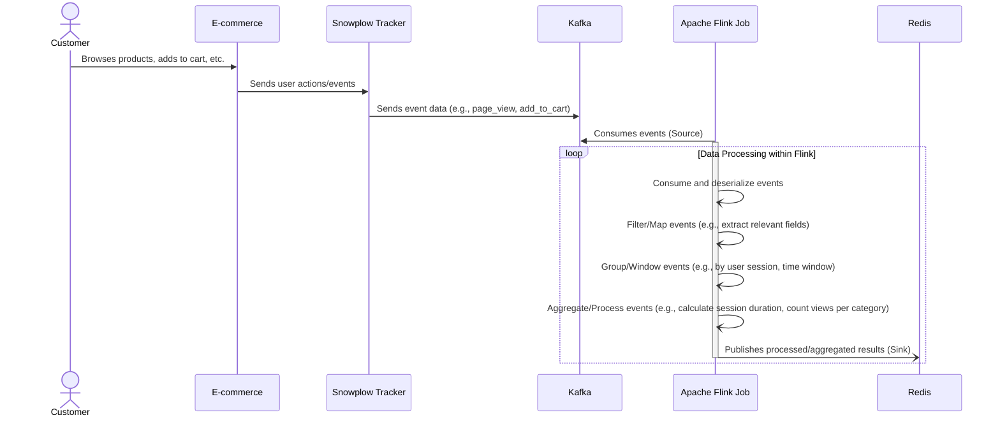

# Live Shopper Features

## 📌 Overview

This project demonstrates how to do real-time analytics and custom actions while a Shopper/User is still browsing the
e-commerce store. It showcases how modern data streaming techniques can be applied to build highly reactive systems in
retail environments.

By leveraging event-driven architecture, this pipeline empowers developers and product teams to:

- Capture behavioral signals the moment they occur
- Derive rich user-centric features with sub-second latency
- React to customer activity while they're still engaged

This is particularly powerful in e-commerce, where context and timing can define conversion outcomes. Whether it's
calculating average price viewed, monitoring cart activity, or determining session bounce rates, the system continuously
evaluates what matters, as it happens.

The "Live Shopper" system is a real-time data processing pipeline designed for e-commerce platforms. Its goal is to
derive actionable user behavior insights while shoppers are actively browsing the store. Built using Apache Flink,
Snowplow, Kafka, and Redis, this system enables near-instant analytics and personalization.

While the current implementation focuses on deriving features from behavioral data, the platform also lays the
groundwork for real-time, in-flight personalization capabilities, including:

- Dynamic content updates on the website while the shopper is still active
- Specialized, behavior-driven coupon generation
- Targeted messaging or offers based on current session intent

## 🔍 Derive Insights While the Shopper Is Still in the Store

Through real-time stream processing, the system continuously computes engagement metrics such as:

- Product views
- Cart activity
- Session behaviors

These features can be used to inform:

- Personalized recommendations
- Dynamic promotions and pricing
- Real-time support interventions

## 🏗️ Architecture

C1 Context architecture

C2 Containers architecture

C3 Components architecture

Product context

Session context

Full context

### Data Flow

1. **Client-Side Tracking:**

    - The Next.js-based e-commerce store emits user interactions (e.g., `product_view`, `add_to_cart`) via the *
      *Snowplow JavaScript Tracker**.

2. **Ingestion Pipeline:**

    - Events are captured by the **Snowplow Collector** and processed via **Snowplow Enrich**.
    - **Snowbridge** forwards enriched events into **Kafka** topics.

3. **Stream Processing (Apache Flink):**

    - Events are parsed, filtered, and split into different logical branches.
    - Processing paths include:
        - **Product Features:** Count views, average price viewed, price range.
        - **Cart Behavior:** Add/remove counts, cart value, update frequency.
        - **Category Engagement:** Category views, repeat views.
        - **Purchase History:** Aggregates purchase data over rolling windows (e.g., 24hr) to calculate total spend,
          order count, etc.
        - **Session Analytics:** Duration, bounce rate, marketing source, etc.

4. **Feature Store (Redis):**

    - Features are written to **Redis** using structured keys, e.g., `user:{user_id}:features:5min`
    - These metrics are available for real-time lookups by downstream systems.

### Windowing Strategies

#### Rolling Window (for continuous stats)

- Implemented using custom `RollingWindowProcessFunction`
- **Examples:**
    - `product_view_count_5min`
    - `cart_add_count_1hr`
- Emits every fixed interval (e.g., every 30s)
- Data window shifts as new events arrive

#### Session Window (per user session)

- Implemented using `SessionWindowProcessFunction`
- Sessions end when no activity occurs for a configurable duration (e.g., 30 minutes)
- **Examples:**
    - `session_duration`
    - `session_cart_ratio`

## ⚙️ Deployment and Components

### Java Application (Apache Flink)

- Main class: `SnowplowAnalyticsPipeline`
- Window operators for each type of feature (product, cart, session, etc.)
- Uses Flink's native event-time support and watermarking

### Fat JAR Packaging

- The Flink job is compiled into a single deployable **Fat JAR**
- Deployed to Flink runtime cluster using CLI or UI

### Docker-based Infra (for Local Dev)

- Components include:
    - Kafka
    - Redis
    - Snowplow collector + enrich
    - AKHQ (Kafka UI)
    - RedisInsight (Redis UI)
    - Grafana (monitoring)

## 🧠 Feature Catalog

### Rolling Window Metrics (5min / 1hr)

- `product_view_count_{window}`
- `category_view_count_{window}`
- `cart_add_count_{window}`
- `cart_remove_count_{window}`
- `cart_value_{window}`
- `avg_viewed_price_{window}`
- `price_range_viewed_{window}`

### Session Metrics

- `session_duration`
- `session_page_count`
- `session_bounce`
- `session_cart_ratio`
- `session_search_count`

### Historical 24hr Features

- `orders_count_24hr`
- `order_value_24hr`
- `avg_order_value_24hr`
- `top_category_24hr`
- `unique_categories_24hr`

### Shopper Context

- `shopper_locations`
- `shopper_device_types`
- `shopper_latest_platform`
- `shopper_region_changes`

## 💡 Key Takeaways

- **Real-Time Readiness:** Enables real-time decisions based on fresh behavioral data.
- **Low Latency:** Metrics are available within seconds via Redis.
- **Extensibility:** Modular Flink operators allow easy addition of new features.

### Custom Window Logic

- Unlike traditional Flink windowing, this pipeline uses **custom rolling and session logic**:
    - Events are retained in keyed state
    - Timers trigger processing at configurable intervals
    - Enables live, sliding window outputs (not just post-window emission)

## 🔭 Out of Scope (But Possible Extensions)

### Model Training

While this accelerator focuses on feature generation, the features in Redis can be used for:

- Training machine learning models (e.g., XGBoost, LightGBM)
- Platforms: Databricks, SageMaker, Vertex AI

### Online Decisioning

The features can also support real-time decisions like:

- Product ranking
- Campaign triggers
- Support prompts
- Custom coupons

## 🚀 Next Steps

- Introduce personalized UI elements (e.g., badges, alerts) based on Redis metrics
- Feed real-time data to recommendation models
- Extend the feature set (e.g., promotion clicks, checkout funnel analysis)
- Apply session intent features to dynamically adjust content or offers

